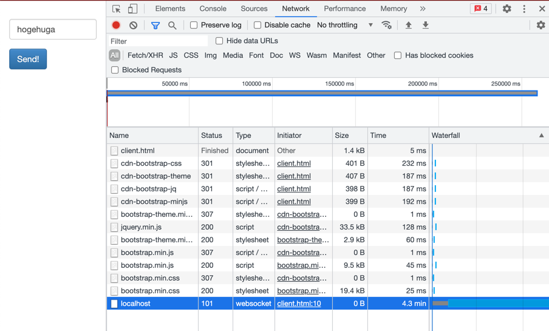
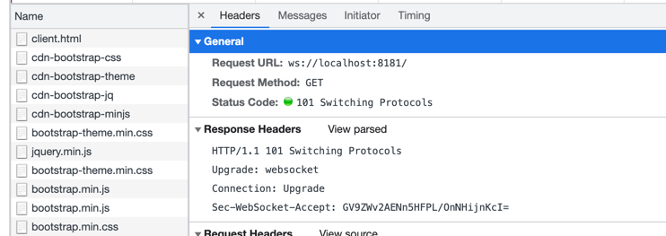
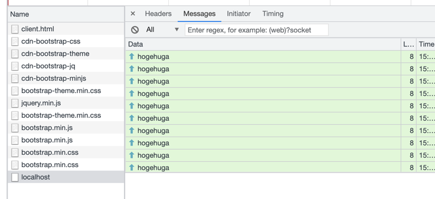
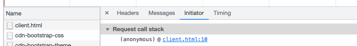

# Echo

Chrome developer console.



Copy as Curl

```
curl 'ws://localhost:8181/' \
  -H 'Pragma: no-cache' \
  -H 'Origin: null' \
  -H 'Accept-Language: en-US,en;q=0.9' \
  -H 'Sec-WebSocket-Key: 1CrKNZMpvvE2RDF4Aa866w==' \
  -H 'User-Agent: Mozilla/5.0 (Macintosh; Intel Mac OS X 10_15_7) AppleWebKit/537.36 (KHTML, like Gecko) Chrome/92.0.4515.131 Safari/537.36' \
  -H 'Upgrade: websocket' \
  -H 'Sec-WebSocket-Extensions: permessage-deflate; client_max_window_bits' \
  -H 'Cache-Control: no-cache' \
  -H 'Connection: Upgrade' \
  -H 'Sec-WebSocket-Version: 13' \
  --compressed
```

## Deep dive

### Status

What's 101?

https://developer.mozilla.org/en-US/docs/Web/HTTP/Status/101

> The HTTP 101 Switching Protocols response code indicates the protocol the server is switching to as requested by a client which sent the message including the Upgrade request header.

Upgrade request headerがつけられたリクエストの場合に行われる。

### Protocol upgrade mechanism

プロトコルアップグレードのメカニリズムは以下の解説がよさそう。

https://developer.mozilla.org/en-US/docs/Web/HTTP/Protocol_upgrade_mechanism

WebSocket connectionに絞った解説は以下。

https://developer.mozilla.org/en-US/docs/Web/HTTP/Protocol_upgrade_mechanism#upgrading_to_a_websocket_connection

`ws://`というスキーマがwebsocket connectionであることを示している。
`wss://`というスキーマはsecure WebSocket connectionであることを示している。

### Request header `Upgrade`

UpgradeというヘッダーはHTTP1.1onlyで対応しているもの。HTTP/2では対応させていない。

```
  -H 'Upgrade: websocket' \
```

https://developer.mozilla.org/en-US/docs/Web/HTTP/Headers/Upgrade

Connection headerが`Upgrade`であることはマストである。

> Note: Connection: upgrade must be set whenever Upgrade is sent.

```
  -H 'Connection: Upgrade' \
```

このUpgradeヘッダーが来た場合は

まず101レスポンスステータスをUpgrade headerとともに返答する。

> Send back a 101 Switching Protocols response status with an Upgrade header that specifies the protocol(s) being switched to. For example:

### Request Header `Sec-WebSocket-Extensions`

デフォルトでNodeのwsでWebSocket Connectionを作る場合、以下のヘッダーがくっついている。

```
  -H 'Sec-WebSocket-Extensions: permessage-deflate; client_max_window_bits' \
```

https://developer.mozilla.org/en-US/docs/Web/HTTP/Protocol_upgrade_mechanism#upgrading_to_a_websocket_connection

> Specifies one or more protocol-level WebSocket extensions to ask the server to use.

一つ以上のWebSocket extensionsを設定することができる。

extensionsはIANAで登録されているものから選択する。

https://www.iana.org/assignments/websocket/websocket.xml#extension-name

今回使われたのは

- permessage-deflate: WebSocket Per-Message Deflate

RFC7692: https://www.rfc-editor.org/rfc/rfc7692.html#page-12

>  This section defines a specific PMCE called "permessage-deflate".  It
compresses the payload of a message using the DEFLATE algorithm
[RFC1951] and uses the byte boundary alignment method introduced in
[RFC1979].

`DEFLATE`アルゴリズムというアルゴリズムがRFC1951で定義されている。

https://www.rfc-editor.org/rfc/rfc1951

- client_max_window_bits

これは上述した `permessage-deflate` にパラメータ、４つあるうちの一つである

```
   o  "server_no_context_takeover"
   o  "client_no_context_takeover"
   o  "server_max_window_bits"
   o  "client_max_window_bits"
```

### Request Header: `Sec-WebSocket-Key`

こういうヘッダーもついている。

```
  -H 'Sec-WebSocket-Key: 1CrKNZMpvvE2RDF4Aa866w==' \
```

<https://developer.mozilla.org/en-US/docs/Web/HTTP/Protocol_upgrade_mechanism#upgrading_to_a_websocket_connection>にて解説されている。

Upgradeする際に必要とする情報の提供のためのヘッダーである。

> Provides information to the server which is needed in order to confirm that the client is entitled to request an upgrade to WebSocket.

HTTPの場合も多少の悪用を回避するためにつけられるHeader

> This header can be used when insecure (HTTP) clients wish to upgrade, in order to offer some degree of protection against abuse.

WebSocketの仕様によって定義されたアルゴリズムによってkeyが計算される。そのためこのキーは機密性を提供するものではない。
WebSocket以外のクライアントによる誤用でWebSocket接続要求をするのを防ぐために用いられる。

「まじでわいはWebSocket接続したんやで？」っていう宣言程度のもの。

Responseでは、`Sec-WebSocket-Accept: GV9ZWv2AENn5HFPL/OnNHijnKcI=`といったヘッダーが付与されるが、これはwebsocketサーバーによって計算されたものがつけられる。

> The server's response's Sec-WebSocket-Accept header will have a value computed based upon the specified key.

### Request header `Sec-WebSocket-Version`

こういうヘッダーもついてくる。

> Specifies the WebSocket protocol version the client wishes to use, so the server can confirm whether or not that version is supported on its end.

```
  -H 'Sec-WebSocket-Version: 13' \
```

WebSocket protocol versionがいくつかある。サポート外ならダメだよってサーバーから返答されるようなもの。

IANAに登録されているものが使われる。

https://www.iana.org/assignments/websocket/websocket.xml#version-number

現在のStandardはVersion 13


### Response Headers



Upgrade: websocket
Connection: Upgrade
Sec-WebSocket-Accept: GV9ZWv2AENn5HFPL/OnNHijnKcI=

### Messages



### Initiator

Initiator



Request initiator chain