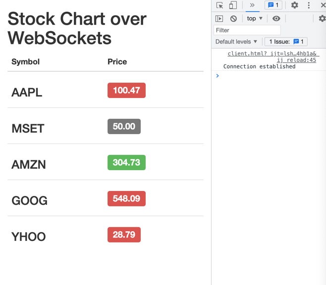
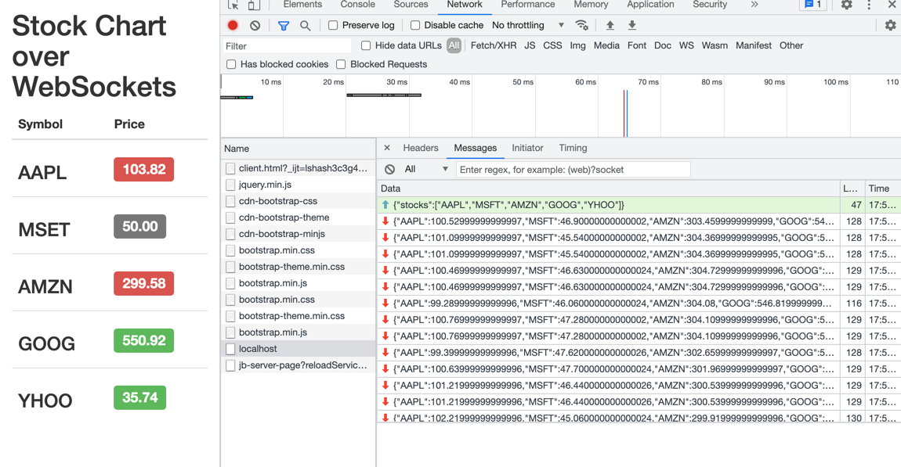

# Stock Chart



Messages



- client send message (fired open)

```js
ws.send(JSON.stringify(stock_request));
```

- server send message

```js
    clientStockUpdater = setInterval(function() {
        sendStockUpdates(ws)
    }, 1000);

    var clientStocks = [];

    ws.on('message', function(message) {
        var stock_request = JSON.parse(message);
        clientStocks = stock_request['stocks'];
        sendStockUpdates(ws);
    })
```

## Deep dive

### WebSocket Event

WebSocket fires four events.

https://www.w3.org/TR/websockets/#websocket

- open
- message
- error
- close

JavaScript側ではそれらのeventHandlerが定義されている


Event handler |	Event handler event type
onopen	open
onmessage	message
onerror	error
onclose	close

Defaultで何もしないときはnullっていう感じ。

```js
    onclose: ((this: WebSocket, ev: CloseEvent) => any) | null;
    onerror: ((this: WebSocket, ev: Event) => any) | null;
    onmessage: ((this: WebSocket, ev: MessageEvent) => any) | null;
    onopen: ((this: WebSocket, ev: Event) => any) | null;
```

### WebSocket Event PING/PONG

PINGはServerからしか送られない。ClientはPONGと応答してあげんといけんよ。

### WebSocket Methods

Clientから施行できるWebSocket Methodsは`send()`と`close()`だけ。

closeにはserver側になぜcloseしたのかを通達するステータスコードがあり。

### WebSocket Attributes

WebSocket のイベント発火時、WebSocketオブジェクトはいくつかattributesがあるよ

- readyState
  - CONNECTION: yet
  - OPEN: ready
  - CLOSING: in the process of closing
  - CLOSED: closed
- WebSocket
- protocol (optional)
### HTML

```html
    <meta http-equiv="X-UA-Compatible" content="IE=edge">
```